# EventOS Developer Handbook

**Version:** derived from the repository at commit `f912143` (`origin/main`).
See [22.3](#223-commit-provenance).
**Generated:** 14 August 2026
**Scope:** the `wedding-planner-os` repository as it exists today

---

## How to read this handbook

Everything here was derived by reading the repository. Where a fact could not be
established from the code, this document says **"Not implemented / not found in the
current repository"** rather than filling the gap with a plausible guess.

Three labels appear throughout:

| Label | Meaning |
|---|---|
| *(verified)* | Read directly out of the named file. Default — most statements are this. |
| *(inference)* | A reasonable reading of the code, not an explicit statement in it. Treat with care. |
| *(not found)* | Asked for, but absent from the repository. |

File paths are relative to the repository root and were checked for existence. Function
names are as they are exported.

---

## Table of contents

1. [System Overview](#1-system-overview)
   - [1.1 What EventOS is](#11-what-eventos-is)
   - [1.2 Current product capabilities](#12-current-product-capabilities)
   - [1.3 High-level architecture](#13-high-level-architecture)
   - [1.4 Technology stack](#14-technology-stack)
   - [1.5 Major external services](#15-major-external-services)
2. [Repository Structure](#2-repository-structure)
   - [2.1 Top level](#21-top-level)
   - [2.2 `src/` in detail](#22-src-in-detail)
   - [2.3 Important individual files](#23-important-individual-files)
   - [2.4 Generated and build artefacts](#24-generated-and-build-artefacts)
3. [Frontend Architecture](#3-frontend-architecture)
   - [3.1 App Router structure](#31-app-router-structure)
   - [3.2 Layouts](#32-layouts)
   - [3.3 Server vs client components](#33-server-vs-client-components)
   - [3.4 State management](#34-state-management)
   - [3.5 Forms and Server Actions](#35-forms-and-server-actions)
   - [3.6 Navigation](#36-navigation)
   - [3.7 Loading, error and 404 behaviour](#37-loading-error-and-404-behaviour)
4. [Backend Architecture](#4-backend-architecture)
   - [4.1 The service layer](#41-the-service-layer)
   - [4.2 Server Actions](#42-server-actions)
   - [4.3 API routes](#43-api-routes)
   - [4.4 Validation](#44-validation)
   - [4.5 Database access](#45-database-access)
   - [4.6 Authorization boundaries](#46-authorization-boundaries)
5. [Data Flow](#5-data-flow)
   - [5.1 The general path](#51-the-general-path)
   - [5.2 Authentication flow](#52-authentication-flow)
   - [5.3 Invitation flow](#53-invitation-flow)
   - [5.4 RSVP flow](#54-rsvp-flow)
   - [5.5 Publishing flow](#55-publishing-flow)
   - [5.6 Email flow](#56-email-flow)
   - [5.7 Upload flow](#57-upload-flow)
   - [5.8 Legal acceptance flow](#58-legal-acceptance-flow)
6. [Database](#6-database)
   - [6.1 Entity relationship diagram](#61-entity-relationship-diagram)
   - [6.2 Models](#62-models)
   - [6.3 Enums](#63-enums)
   - [6.4 Cascades and delete behaviour](#64-cascades-and-delete-behaviour)
   - [6.5 Indexes and constraints worth knowing](#65-indexes-and-constraints-worth-knowing)
   - [6.6 Migration history](#66-migration-history)
   - [6.7 Seed data](#67-seed-data)
   - [6.8 Production vs Preview vs E2E databases](#68-production-vs-preview-vs-e2e-databases)
7. [Authentication & Authorization](#7-authentication-and-authorization)
   - [7.1 Login](#71-login)
   - [7.2 Sessions and cookies](#72-sessions-and-cookies)
   - [7.3 Password hashing and reset](#73-password-hashing-and-reset)
   - [7.4 Roles and permissions](#74-roles-and-permissions)
   - [7.5 Tenant isolation](#75-tenant-isolation)
   - [7.6 IDOR protections](#76-idor-protections)
   - [7.7 Middleware vs server-side authorization](#77-middleware-vs-server-side-authorization)
   - [7.8 The Terms and Privacy gate](#78-the-terms-and-privacy-gate)
8. [Wedding Lifecycle](#8-wedding-lifecycle)
9. [Guest & Invitation System](#9-guests-and-invitations)
10. [Templates](#10-templates)
11. [Email](#11-email)
12. [Storage & Uploads](#12-storage-and-uploads)
13. [Environment Variables](#13-environment-variables)
14. [Deployment](#14-deployment)
15. [Security Architecture](#15-security-architecture)
16. [Error Handling](#16-error-handling)
17. [Logging & Observability](#17-logging-and-observability)
18. [Testing](#18-testing)
19. [Debugging Runbook](#19-debugging-runbook)
20. [Safe Development Guidelines](#20-safe-development-guidelines)
21. [External Integrations](#21-external-integrations)
22. [Appendix: verification notes](#22-appendix-verification-notes)

---

# 1. System Overview

## 1.1 What EventOS is

EventOS is a multi-tenant SaaS for **professional event planners**. The live product is
Weddings; the marketing site (`src/app/(marketing)/page.tsx`) lists Corporate Events,
Conferences, Birthdays and Galas as "Coming soon" — **none of those are implemented**.

The tenant is a **Studio**. A studio has planner users, weddings, guests, payments and
support tickets. Every planner-facing query is scoped to one studio.

The product's distinguishing idea, stated on `src/app/(marketing)/weddings/page.tsx`: a
guest does not get a shared wedding website, they get **their own** — showing only the
events they are invited to, their own RSVP, and their own seat.

> **There is no couple-facing or guest-facing account.** Guests are identified by an
> unguessable invite code in a URL; they never register, log in or set a password. The
> only roles in the system are `ADMIN`, `PLANNER` and `MEMBER` (`prisma/schema.prisma`).

## 1.2 Current product capabilities

Verified by the existence of the corresponding routes and services:

**Planner (`/studio/*`)**

- Create, edit, duplicate, publish, unpublish and delete weddings — `src/server/services/weddings.ts`
- Choose one of six visual templates — `src/lib/themes.ts`
- Guest list with groups, CSV import and CSV export — `src/server/services/guests.ts`
- Send invitations in bulk, or resend to one guest — `src/server/services/invite-actions.ts`
- Multi-event schedule with per-guest visibility — `src/server/services/events.ts`
- RSVP tracking with meal and dietary notes — `src/server/services/rsvp.ts`
- Seating plan with tables and per-event seats — `src/server/services/seating.ts`
- Gift registry and cash funds — `src/server/services/registry.ts`
- Photo upload per slot (hero, couple, story, gallery) — `src/server/services/photos.ts`
- Studio branding: logo, brand colour, font — `src/server/services/branding.ts`
- Billing history and plan — `src/app/studio/billing/page.tsx`
- Help Center with 26 articles and support tickets — `src/lib/help.ts`, `src/server/services/support.ts`
- Must accept the current Terms of Service and Privacy Policy before any access — `src/server/services/legal.ts`

**Platform admin (`/admin/*`)**

- Create planner studios and issue invitations — `src/server/services/admin.ts`
- Suspend, reactivate, delete studios, reset planner passwords — same file
- Global and per-studio pricing — `src/server/services/pricing-admin.ts`
- Access requests queue — `src/server/services/access-requests.ts`
- Support ticket queue — `src/server/services/support.ts`
- Audit log viewer — `src/app/admin/activity/page.tsx`
- Payments list — `src/app/admin/payments/page.tsx`

**Guest (public, no account)**

- Personal invitation portal at `/invite/[code]`
- Public wedding site at `/w/[slug]` (published weddings only)
- Registry at `/w/[slug]/registry`
- Calendar feed at `/calendar/[token]/[event]`

**Public documents (no account)**

- Terms of Service at `/terms` and Privacy Policy at `/privacy` — `src/app/(marketing)/terms/page.tsx`, `src/app/(marketing)/privacy/page.tsx`

## 1.3 High-level architecture

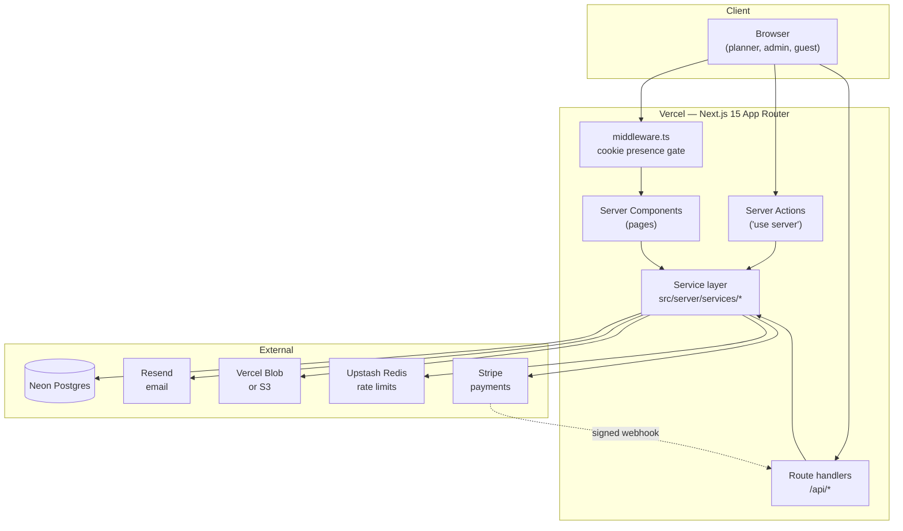

The shape to hold in your head: **pages and actions never touch the database directly**
in the planner and admin trees — they call a service, and the service owns the tenant
scoping. There are a small number of deliberate exceptions, noted in
[4.5](#45-database-access).

## 1.4 Technology stack

Read from `package.json`:

| Layer | Choice | Version |
|---|---|---|
| Framework | Next.js (App Router) | `^15.1.4` |
| UI | React | `^19.0.0` |
| Language | TypeScript | `^5` (devDependency) |
| ORM | Prisma Client | `^6.2.0` |
| Database | PostgreSQL (Neon) | — |
| Auth | NextAuth / Auth.js | `^5.0.0-beta.25` |
| Passwords | bcryptjs | `^2.4.3` |
| Validation | Zod | `^3.24.1` |
| Email | Resend | `^4.0.1` |
| Payments | Stripe | `^17.5.0` |
| Blob storage | `@vercel/blob` | `^2.6.1` |
| S3 storage | `@aws-sdk/client-s3` | `^3.1100.0` |
| Images | sharp | `^0.35.3` |
| Ids | nanoid | `^5.0.9` |
| Smooth scroll | lenis | `^1.3.25` |
| Unit tests | Vitest | `^3` (dev) |
| E2E tests | Playwright | `1.62.1` (dev) |

**Not present:** Remotion, Sentry, Redux, tRPC, tailwind. Styling is hand-written CSS in
`src/app/globals.css`.

## 1.5 Major external services

| Service | Used for | Configured by | Degrades to |
|---|---|---|---|
| **Neon** | PostgreSQL | `DATABASE_URL`, `DIRECT_URL` | Nothing — required |
| **Vercel** | Hosting, build, cron-free runtime | Platform | Nothing — required |
| **Resend** | All outbound email | `RESEND_API_KEY`, `EMAIL_FROM` | Emails recorded `SKIPPED`, app keeps working |
| **Vercel Blob** *or* **S3** | Photo and logo storage | `BLOB_READ_WRITE_TOKEN` or `S3_*` | Local filesystem driver in dev |
| **Upstash Redis** | Distributed rate limiting | `UPSTASH_REDIS_REST_URL/TOKEN` | In-process `Map` (see [15.7](#15-security-architecture)) |
| **Stripe** | Publishing payments, subscriptions | `STRIPE_SECRET_KEY`, `STRIPE_WEBHOOK_SECRET` | Publishing fails closed in production |

---

# 2. Repository Structure

## 2.1 Top level

```
wedding-planner-os/
├── prisma/              schema, migrations, seed, operational scripts
├── public/              static assets served verbatim (incl. the launch film)
├── scripts/             one-off developer scripts
├── src/                 all application code
├── tests/               unit tests (vitest) and e2e tests (playwright)
├── docs/                this handbook
├── .github/workflows/   CI
├── next.config.mjs      security headers, CSP, image config
├── playwright.config.ts E2E runner + E2E environment
├── vitest.config.ts     unit test runner + coverage thresholds
├── eslint.config.mjs    lint rules
└── package.json         scripts and dependencies
```

Markdown at the root is operational documentation, not code:
`README.md`, `DEPLOYMENT.md`, `OPERATIONS.md`, `SECURITY.md`, `SECURITY_AUDIT.md`,
`SECURITY-AUDIT-2026-08.md`, `AUDIT.md`, `EMAIL.md`, `SUPPORT.md`.

## 2.2 `src/` in detail

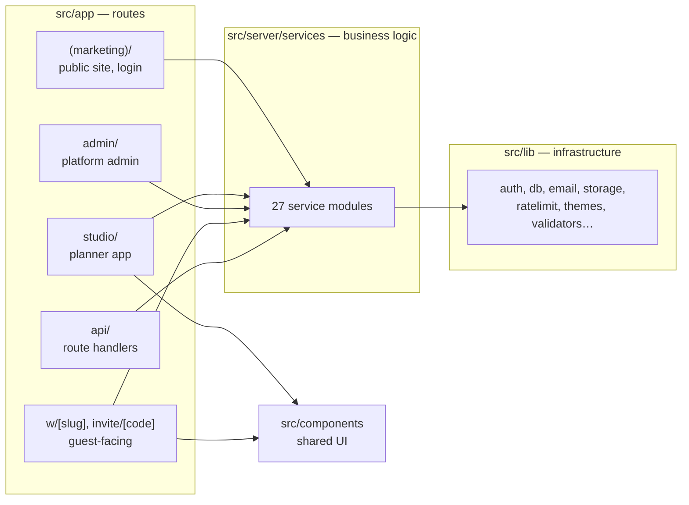

| Folder | Purpose |
|---|---|
| `src/app/(marketing)/` | Public marketing site, login, forgot/reset password, request access. The `(marketing)` parentheses are a Next route group — they do not appear in URLs. |
| `src/app/studio/` | The planner application. Gated by `requireStudio()`. |
| `src/app/admin/` | Platform owner application. Gated by `requireAdmin()`. |
| `src/app/w/[slug]/` | Public wedding website. Published weddings only. |
| `src/app/invite/[code]/` | Personal guest portal. No account. |
| `src/app/calendar/[token]/[event]/` | `.ics` calendar feed. |
| `src/app/api/` | Route handlers: auth, health, ready, build, Stripe webhook. |
| `src/server/services/` | **All business logic.** 27 modules. Every one begins `import "server-only"`. |
| `src/lib/` | Infrastructure: database client, auth config, email, storage drivers, rate limiter, themes, validators, logging. |
| `src/components/` | Shared React components, both server and client. |

## 2.3 Important individual files

| File | Responsibility |
|---|---|
| `src/lib/auth.ts` | NextAuth configuration: credentials provider, JWT session, `__Host-` cookie, session revocation, timing equalisation. Exports `auth`, `signIn`, `signOut`, `handlers`, `SESSION_COOKIE`, `SessionUser`. |
| `src/lib/db.ts` | The Prisma client singleton. Five lines. |
| `src/server/services/context.ts` | **The authorization boundary.** `requireAdmin()`, `requireStudio()`, `ownWedding()`. |
| `src/lib/validators.ts` | Ten Zod schemas — every user-supplied object is parsed through one. |
| `src/lib/email.ts` | Resend integration, retry, redaction, `EmailLog` recording, `emailConfig()` diagnostics. |
| `src/lib/storage.ts` | Storage driver interface with three implementations (blob, s3, local). |
| `src/lib/storage-config.ts` | One shared predicate for "is storage configured", used by `env.ts`, `storage.ts` and `/api/ready`. |
| `src/lib/ratelimit.ts` | Upstash-backed limiter with in-process fallback. |
| `src/lib/lockout.ts` | Login throttle: per-account and per-IP counters, escalating delay. |
| `src/lib/env.ts` | Boot-time environment validation. Throws in production. |
| `src/lib/logger.ts` | Structured JSON logging with secret redaction. |
| `src/lib/themes.ts` | The six wedding templates and their palettes. |
| `src/lib/errors.ts` | `UserError` (safe to show) and `reportError()` (log real, return safe). |
| `src/lib/legal.ts` | `TERMS_VERSION`, `PRIVACY_VERSION`, and the review notice. Bumping a constant here re-gates every planner. |
| `src/middleware.ts` | Edge cookie-presence gate for `/studio` and `/admin`. **Not the security boundary.** |
| `next.config.mjs` | CSP, security headers, Server Action allowed origins, image remote patterns. |
| `prisma/schema.prisma` | 25 models, 17 enums. |
| `prisma/seed.ts` | Development demo data. |
| `prisma/create-admin.ts` | Creates a real platform admin. Used on production and preview. |

## 2.4 Generated and build artefacts

**Never edit these; they are produced by tooling:**

| Path | Produced by |
|---|---|
| `.next/` | `next build` |
| `node_modules/` | `npm install` |
| `next-env.d.ts` | Next.js |
| `tsconfig.tsbuildinfo` | TypeScript incremental build |
| `coverage/` | `vitest run --coverage` |
| `test-results/`, `playwright-report/` | Playwright (both gitignored) |
| `src/lib/demo-photos.generated.ts` | `scripts/build-demo-photos.ts` |
| `prisma/migrations/*/migration.sql` | `prisma migrate dev` — **and must never be hand-edited once applied** (see [20.2](#20-safe-development-guidelines)) |
| `ph/` | Product Hunt marketing images. Not application code. |

---

# 3. Frontend Architecture

## 3.1 App Router structure

Next.js 15 App Router. **Every page is a React Server Component by default.** Client
components are the exception and are marked `"use client"`.

Route inventory, verified by `find src/app -name page.tsx`:

**Public / marketing**

| Route | File |
|---|---|
| `/` | `src/app/(marketing)/page.tsx` |
| `/weddings` | `src/app/(marketing)/weddings/page.tsx` |
| `/login` | `src/app/(marketing)/login/page.tsx` |
| `/forgot-password` | `src/app/(marketing)/forgot-password/page.tsx` |
| `/reset-password/[token]` | `src/app/(marketing)/reset-password/[token]/page.tsx` |
| `/request-access` | `src/app/(marketing)/request-access/page.tsx` |
| `/terms` | `src/app/(marketing)/terms/page.tsx` |
| `/privacy` | `src/app/(marketing)/privacy/page.tsx` |
| `/accept-terms` | `src/app/accept-terms/page.tsx` — the legal gate |
| `/continue` | `src/app/continue/page.tsx` |
| `/dashboard` | `src/app/dashboard/page.tsx` |

**Guest-facing**

| Route | File |
|---|---|
| `/w/[slug]` | `src/app/w/[slug]/page.tsx` |
| `/w/[slug]/registry` | `src/app/w/[slug]/registry/page.tsx` |
| `/invite/[code]` | `src/app/invite/[code]/page.tsx` |

**Planner** — all under `src/app/studio/`

`/studio`, `/studio/weddings`, `/studio/weddings/new`, `/studio/weddings/[id]`,
`/studio/weddings/[id]/guests`, `/photos`, `/preview`, `/registry`, `/rsvps`,
`/schedule`, `/seating`, `/studio/billing`, `/studio/settings`,
`/studio/templates/[template]`, `/studio/help`, `/studio/help/[slug]`,
`/studio/help/tickets`, `/studio/help/tickets/new`, `/studio/help/tickets/[id]`

**Admin** — all under `src/app/admin/`

`/admin`, `/admin/planners`, `/admin/planners/[id]`, `/admin/weddings`,
`/admin/payments`, `/admin/settings`, `/admin/requests`, `/admin/activity`,
`/admin/templates`, `/admin/support`, `/admin/support/[id]`

## 3.2 Layouts

Four layouts (`find src/app -name layout.tsx`):

| Layout | Responsibility |
|---|---|
| `src/app/layout.tsx` | Root. Loads six Google fonts via `next/font` (Cormorant Garamond, Inter, Italiana, Pinyon Script, Playfair Display, Sacramento) and imports `globals.css`. Fonts are self-hosted with size-adjusted fallbacks to avoid layout shift. |
| `src/app/(marketing)/layout.tsx` | Marketing chrome — nav and footer. |
| `src/app/studio/layout.tsx` | Planner sidebar. Calls `requireStudio()`. |
| `src/app/admin/layout.tsx` | Admin sidebar. Calls `requireAdmin()`. |

Calling the guard in the layout **and** in each page is deliberate: a layout is not a
security boundary in the App Router, because a page can be rendered without its layout in
some navigation cases. *(inference — the code does both consistently, and
`src/app/admin/support/page.tsx` carries a comment to this effect.)*

## 3.3 Server vs client components

Client components — the complete list (18), from `grep -rl '"use client"' src/components`:

| Component | Why it must be client |
|---|---|
| `src/components/InviteButtons.tsx` | `useActionState` for pending state on send/resend |
| `src/components/Wishlist.tsx` | `useActionState` for gift claiming |
| `src/components/RsvpForm.tsx` | Interactive form state |
| `src/components/Gallery.tsx` | Lightbox interaction |
| `src/components/Countdown.tsx` | Ticking timer |
| `src/components/Reveal.tsx` | Scroll-triggered animation |
| `src/components/SmoothScroll.tsx` | Lenis integration |
| `src/components/seating.tsx` | Drag-and-drop seating |
| `src/components/admin-dialogs.tsx` | Confirmation dialogs |
| `src/components/StudioBrandForm.tsx` | Live colour preview |
| `src/components/TimeZoneField.tsx` | Timezone picker |
| `src/components/BackLink.tsx` | Browser history navigation |
| `src/components/CustomDesignCard.tsx` | Request form state |
| `src/components/help/HelpSearch.tsx` | Help Center search |
| `src/components/marketing/AccessForm.tsx` | Access request form |
| `src/components/marketing/FilmPlayer.tsx` | Video playback |
| `src/components/marketing/SiteNav.tsx` | Marketing nav open/close |
| `src/components/AcceptLegalForm.tsx` | Checkbox state and pending state on the legal gate |

Everything else is a Server Component. The pattern: **fetch on the server, pass plain
data down, and make a component client only when it needs an event handler or a hook.**

## 3.4 State management

**There is no state management library.** No Redux, Zustand, Jotai or React Query.

State lives in four places:

1. **The database**, read fresh on each server render.
2. **The URL** — filters and editing state are query parameters (e.g.
   `/studio/weddings/[id]/guests?q=&group=&edit=`).
3. **`useActionState`** — per-form result and pending state in the client components above.
4. **A short-lived cookie** — the one-time password display on `/admin/planners`
   (`src/app/admin/planners/page.tsx`, `FLASH` cookie, 90 second `maxAge`).

Cache invalidation is `revalidatePath()` after mutations. There is no client cache to
keep in sync.

## 3.5 Forms and Server Actions

Two shapes are used, and the choice matters.

**A. Plain form action** — for mutations where a full re-render or redirect is the right
outcome:

```tsx
async function remove(formData: FormData) {
  "use server";
  const { studioId } = await requireStudio();
  await deleteGuest(studioId, String(formData.get("guestId")));
  revalidatePath(`/studio/weddings/${...}/guests`);
}
```

**B. `useActionState` with an outcome object** — for mutations that can fail in an
expected way and must not lose the page:

```tsx
async function resend(_prev: InviteOutcome | null, formData: FormData): Promise<InviteOutcome> {
  "use server";
  const { studioId, user } = await requireStudio();
  return resendInvitationOutcome(studioId, String(formData.get("guestId")), user.name);
}
```

> **The rule that was learned the hard way:** an uncaught throw inside a Server Action is
> rendered by the error boundary, replacing the whole page. Any action that can raise a
> `UserError` — rate limits especially — must catch it and return a result. See
> `src/server/services/invite-actions.ts` and [16](#16-error-handling).

Every action re-derives its tenant with `requireStudio()` **inside the action**, never
from the enclosing render's closure, because a Server Action is a separate request.

## 3.6 Navigation

`next/link` for internal navigation, `redirect()` from `next/navigation` inside actions.

`/dashboard` (`src/app/dashboard/page.tsx`) and `/continue` (`src/app/continue/page.tsx`)
are role-routers: they read the session and forward an admin to `/admin` and a planner to
`/studio`. They are explicitly documented in-file as *not* security boundaries.

## 3.7 Loading, error and 404 behaviour

| File | Behaviour |
|---|---|
| `src/app/error.tsx` | Root error boundary. Client component. Shows a generic apology, a **Try again** button (`reset()`), a link to `/dashboard`, and `error.digest` as a support reference. **Renders nothing from the error object itself.** |
| `src/app/not-found.tsx` | Rendered by `notFound()`. Deliberately does not say "you don't have access", because 404-not-403 is how the app hides the existence of other tenants' data. |

**`loading.tsx` — not found in the current repository.** There are no route-level loading
files; pages render when their data resolves.

---

# 4. Backend Architecture

## 4.1 The service layer

`src/server/services/` holds 27 modules. Every one starts with `import "server-only"`,
which makes importing it from a client bundle a build error.

| Module | Responsibility |
|---|---|
| `access-requests.ts` | Public "request access" submissions and the admin queue |
| `admin.ts` | Create/suspend/delete planner studios, reset planner passwords |
| `audit.ts` | `logAudit()` — the single audit-write function |
| `billing.ts` | `startPublish()`, `completePublishFromStripe()` |
| `branding.ts` | Studio logo upload and removal |
| `calendar-feed.ts` | `.ics` generation |
| `context.ts` | **Authorization primitives** |
| `custom-design.ts` | Custom template requests |
| `events.ts` | Schedule events, and `personalEvents()` for per-guest visibility |
| `guests.ts` | Guest CRUD, CSV import, invitation sending |
| `idempotency.ts` | `runOnce()` — at-most-once side effects |
| `invite-actions.ts` | Outcome-returning wrappers for the two send paths |
| `legal.ts` | `hasAcceptedCurrentLegal()`, `outstandingLegal()`, `acceptCurrentLegal()` |
| `passwordReset.ts` | Token issue/consume, session revocation |
| `photos.ts` | Photo upload, replace, delete, reorder |
| `pricing.ts` | Price **reads** (no session dependency) |
| `pricing-admin.ts` | Price **writes** (admin only) |
| `registry.ts` | Gifts, cash funds, claiming |
| `rsvp.ts` | `submitRsvp()` |
| `seating.ts` | Tables and seats |
| `security-events.ts` | Pseudonymised security logging |
| `settings.ts` | `getSettings()` — the `PlatformSetting` singleton |
| `showcase.ts` | Public example weddings for the marketing page |
| `stripe-events.ts` | Webhook dispatch, idempotency |
| `subscriptions.ts` | Stripe customers, prices, subscription checkout, billing portal |
| `support.ts` | Support tickets, both planner and admin sides |
| `weddings.ts` | Wedding CRUD, duplicate, unpublish |

**Why `pricing.ts` and `pricing-admin.ts` are separate:** reads happen on planner pages
and inside the Stripe webhook, which has no session at all. Keeping `requireAdmin()` out
of the read module stops the whole authentication stack being pulled in behind it.

## 4.2 Server Actions

Server Actions are defined inline in page files, not in a central actions directory.
`next.config.mjs` pins their allowed origins:

```js
allowedOrigins: [process.env.APP_URL, process.env.VERCEL_PROJECT_PRODUCTION_URL]
```

Body size limit is `4.5mb` (`next.config.mjs`), which bounds photo uploads.

## 4.3 API routes

Five route handlers under `src/app/api/`, plus two outside it.

| Route | File | Auth | Purpose |
|---|---|---|---|
| `/api/auth/[...nextauth]` | `.../route.ts` | NextAuth | Sign-in/out endpoints |
| `/api/health` | `.../route.ts` | none | Liveness. Returns 200/503 with no body. |
| `/api/ready` | `.../route.ts` | none | Readiness: `{status, db, configured{...}, ms}` |
| `/api/build` | `.../route.ts` | **ADMIN** | Commit SHA/branch/message. 404s for everyone else. |
| `/api/webhooks/stripe` | `.../route.ts` | **Stripe signature** | Payment and subscription events |
| `/calendar/[token]/[event]` | `src/app/calendar/.../route.ts` | invite code or slug | `.ics` feed |
| `/studio/weddings/[id]/guests/export` | `src/app/studio/.../export/route.ts` | session + studio scope | Guest CSV |

## 4.4 Validation

Ten Zod schemas in `src/lib/validators.ts`:

`zWedding`, `zGuest`, `zEvent`, `zRsvp`, `zGiftClaim`, `zRegistryItem`,
`zStudioBranding`, `zAccessRequest`, `zTicket`, `zTicketReply`

Every free-text field is length-bounded — the security test suite asserts this, so a
request cannot carry a megabyte of story text.

## 4.5 Database access

`src/lib/db.ts` — the entire file:

```ts
import { PrismaClient } from "@prisma/client";

const globalForPrisma = globalThis as unknown as { prisma?: PrismaClient };
export const prisma = globalForPrisma.prisma ?? new PrismaClient();
if (process.env.NODE_ENV !== "production") globalForPrisma.prisma = prisma;
```

The `globalThis` cache is only applied outside production, which is the correct pattern
for serverless: it prevents hot-reload connection exhaustion in dev without keeping a
stale client alive in a warm lambda.

`DATABASE_URL` points at Neon's **pooled** endpoint; `DIRECT_URL` at the direct endpoint,
used by migrations, which need a real session a transaction pooler cannot give
(`prisma/schema.prisma` datasource comment).

**Pages that query Prisma directly** rather than through a service — verified, and each
re-derives the tenant first:

- `src/app/studio/weddings/[id]/guests/page.tsx` — the `editing` lookup, scoped `{ id, studioId, weddingId }`
- `src/app/admin/planners/[id]/page.tsx` — admin, already past `requireAdmin()`
- `src/app/admin/page.tsx`, `src/app/studio/billing/page.tsx` — aggregate reads

## 4.6 Authorization boundaries

`src/server/services/context.ts` is the whole boundary, and it is 29 lines:

```ts
export async function requireAdmin() {
  const session = await auth();
  const user = session?.user as SessionUser | undefined;
  if (!user || user.role !== "ADMIN") redirect("/login");
  return { user };
}

export async function requireStudio() {
  const session = await auth();
  const user = session?.user as SessionUser | undefined;
  if (!user || user.role !== "PLANNER" || !user.studioId) redirect("/login");
  const studio = await prisma.studio.findUnique({ where: { id: user.studioId } });
  if (!studio || studio.status === "SUSPENDED") redirect("/login");
  return { user, studio, studioId: studio.id };
}

export async function ownWedding(studioId: string, weddingId: string) {
  const wedding = await prisma.wedding.findFirst({ where: { id: weddingId, studioId } });
  if (!wedding) redirect("/studio/weddings");
  return wedding;
}
```

`requireStudio()` additionally gates on legal acceptance — see
[7.8](#78-the-terms-and-privacy-gate). The un-gated variant is
`requireStudioSession()`, used by exactly one page.

Three things worth noticing:

1. `requireStudio()` re-reads the studio on every call, so **suspending a studio takes
   effect immediately** rather than at the next login.
2. `MEMBER` is in the `Role` enum but `requireStudio()` accepts only `PLANNER`. A MEMBER
   user cannot reach `/studio`. *(inference: the role appears reserved for future use;
   nothing in the repository grants it access.)*
3. `ownWedding()` **redirects rather than 403s**, so a foreign id and a non-existent id
   are indistinguishable from outside.

---

# 5. Data Flow

## 5.1 The general path

```
Browser
  → middleware.ts            (cookie present? else /login)
  → Server Component page    (requireStudio / requireAdmin)
  → Server Action            (re-derives tenant, parses input with Zod)
  → service                  (owns tenant scoping and business rules)
  → Prisma                   (query always carries studioId)
  → Postgres
  ← result
  ← revalidatePath / redirect / outcome object
  ← re-render
```

## 5.2 Authentication flow

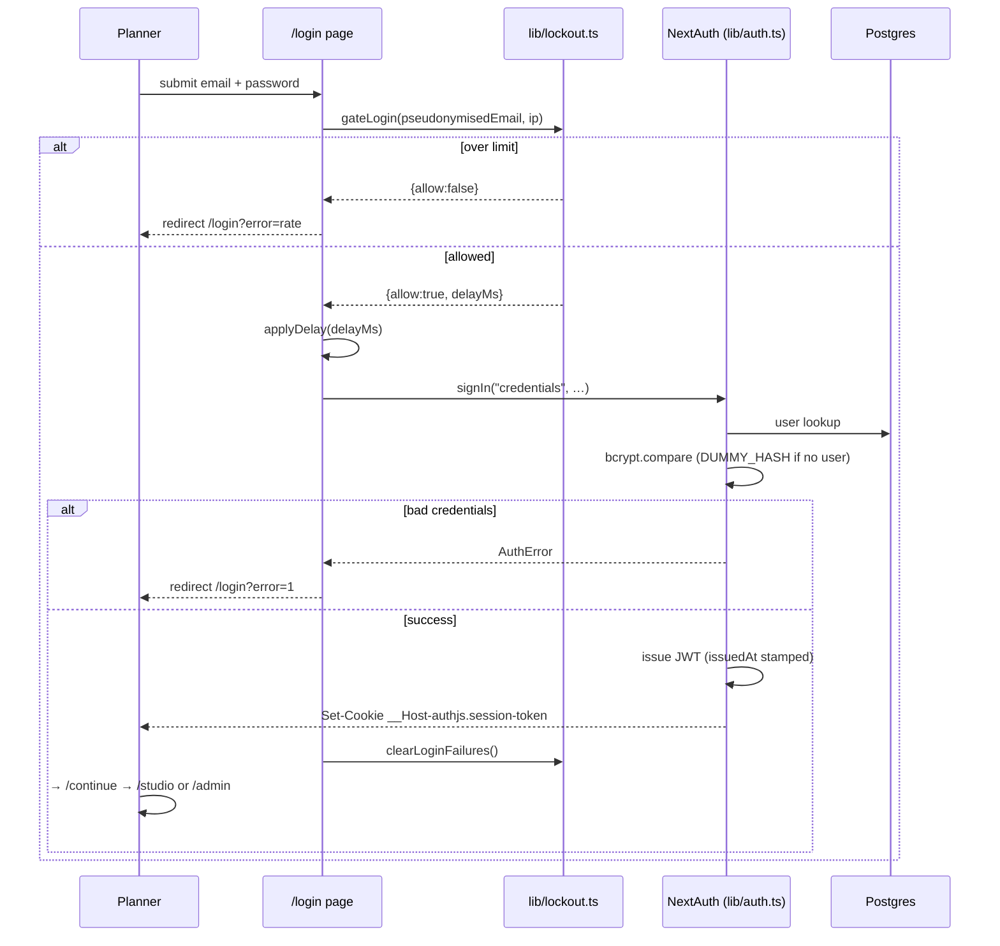

Two details that exist for specific reasons:

- **`DUMMY_HASH`** (`src/lib/auth.ts:42`) — when the email doesn't exist, bcrypt still
  runs against a dummy hash so the response time doesn't reveal whether an account exists.
- **`clearLoginFailures`** runs on the redirect path, detected by the NEXT_REDIRECT
  digest, because `signIn()` always leaves by throwing.

## 5.3 Invitation flow

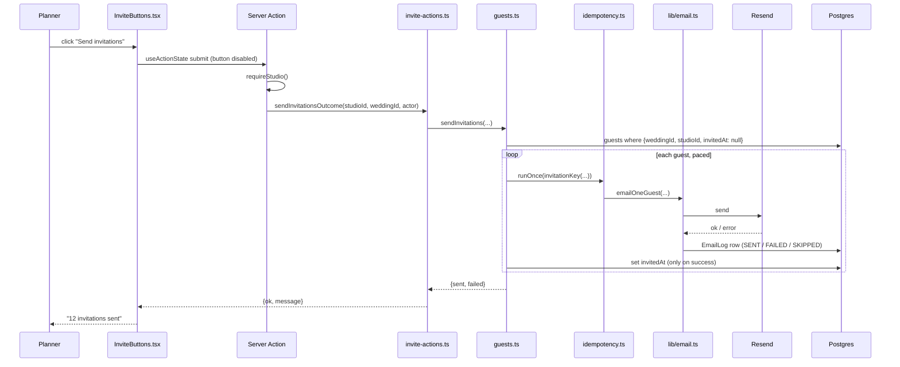

**Partial success is structural:** `invitedAt` is only stamped for guests the provider
accepted, so failures stay un-invited and pressing the same button again retries exactly
those.

## 5.4 RSVP flow

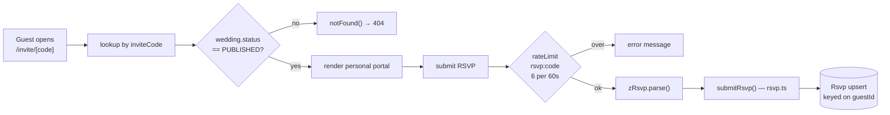

`Rsvp.guestId` is `@unique`, so a guest has at most one RSVP and re-submitting updates it.

## 5.5 Publishing flow

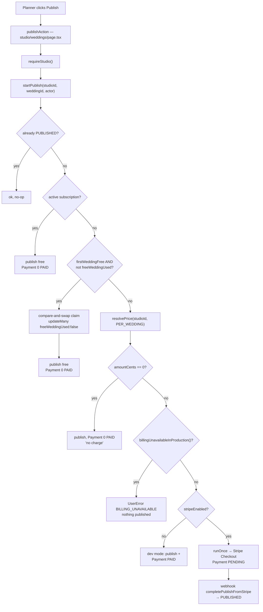

The free-wedding claim at **I** is a conditional `updateMany` rather than read-then-write,
so two concurrent publishes cannot both take the free slot.

## 5.6 Email flow

```
service (e.g. guests.ts)
  → emails.<kind>()                       src/lib/email.ts
  → sendEmail()
      ├── no RESEND_API_KEY  → record SKIPPED, return false   (no network)
      ├── emailConfig() not ready → record SKIPPED, return false
      └── attempt() with 3 tries, backoff [400ms, 1500ms]
            ├── success → record SENT
            └── failure → record FAILED (retryable errors retried)
  ← boolean
```

**`sendEmail` never throws.** Every outcome is a boolean plus an `EmailLog` row. This is
why a bad address cannot crash a page — and why ignoring the return value silently hides
bounces.

## 5.8 Legal acceptance flow

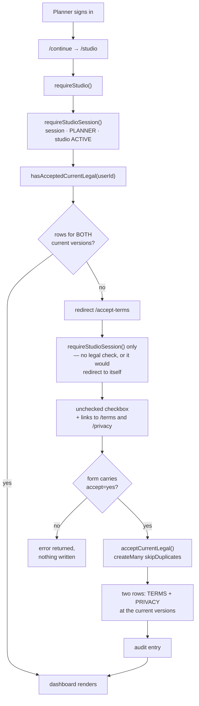

The gate is `requireStudio()`, which every planner page, the studio layout and
every planner Server Action call. One surface cannot inherit it —
`/studio/weddings/[id]/guests/export` is a route handler and route handlers do
not run layouts — so it carries the same check inline and returns **403** rather
than a redirect, because redirecting a fetch would hand the caller a CSV-shaped
file full of HTML.

## 5.7 Upload flow

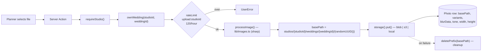

---

# 6. Database

PostgreSQL via Prisma. `prisma/schema.prisma` defines **25 models** and **17 enums**.

## 6.1 Entity relationship diagram

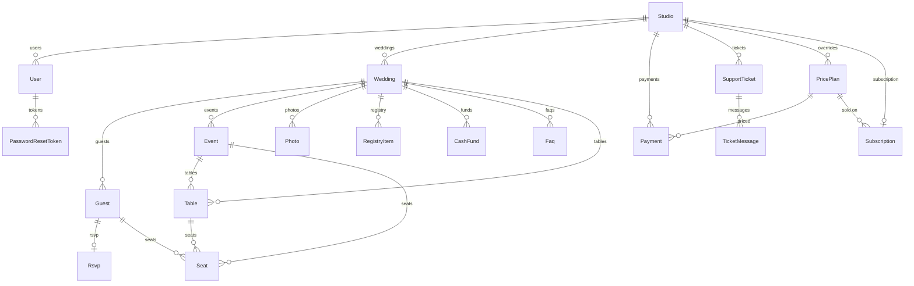

Not shown, because they intentionally have **no foreign keys**: `AuditLog`, `EmailLog`,
`IdempotencyKey` carry a plain `studioId` column so a log outlives the record it
describes. `ProcessedWebhookEvent`, `PlatformSetting` and `AccessRequest` stand alone.

## 6.2 Models

| Model | Key fields | Notes |
|---|---|---|
| `User` | `email @unique`, `passwordHash`, `role`, `studioId?`, `sessionsValidFrom?` | `sessionsValidFrom` is the JWT revocation cutoff |
| `PasswordResetToken` | `tokenHash @unique`, `expiresAt`, `usedAt?` | Token stored hashed, never raw |
| `Studio` | `slug @unique`, `stripeCustomerId @unique`, `freeWeddingUsed`, branding fields | The tenant |
| `Wedding` | `slug @unique`, `template`, `status`, `publishedAt?` | |
| `Guest` | `inviteCode @unique`, `email?`, `groups`, `invitedAt?` | `invitedAt` gates bulk sending |
| `Table` | `shape`, `eventId`, `weddingId` | Seating |
| `Seat` | `@@unique([guestId, eventId])` | One seat per guest per event |
| `Event` | `startsAt`, visibility fields | The schedule |
| `Rsvp` | `guestId @unique`, `status`, `meal`, `dietary`, `notes` | |
| `RegistryItem` | `purchasedBy?` | Claiming uses a conditional update |
| `CashFund` | | |
| `Faq` | | |
| `Payment` | `stripeSessionId @unique`, `stripePaymentIntentId @unique`, `stripeInvoiceId @unique`, `pricePlanId?` | |
| `PricePlan` | `activeKey @unique`, `amountCents`, `studioId?`, `archivedAt?` | Immutable price versions |
| `Subscription` | `studioId @unique`, `stripeSubscriptionId @unique`, `pricePlanId` | Mirrored from Stripe |
| `ProcessedWebhookEvent` | `stripeEventId @unique` | Webhook idempotency |
| `PlatformSetting` | `id Int @default(1)` | Singleton |
| `AuditLog` | `actorType`, `action`, `studioId?` | No FK — survives deletion by design |
| `Photo` | `basePath`, `variants Json`, `blurData`, `tone Json?` | |
| `EmailLog` | `toEmail`, `kind`, `status`, `studioId?` | No FK |
| `AccessRequest` | `status` | Public sign-up requests |
| `IdempotencyKey` | `key @unique`, `completedAt?`, `expiresAt` | Backs `runOnce()` |
| `SupportTicket` | `studioId`, `userId`, `status`, `priority`, `category` | |
| `TicketMessage` | `authorType` | |
| `LegalAcceptance` | `userId`, `document`, `version`, `acceptedAt`, `@@unique([userId, document, version])` | Append-only consent record |

## 6.3 Enums

`Role` (ADMIN, PLANNER, MEMBER) · `StudioStatus` (ACTIVE, SUSPENDED) ·
`WeddingStatus` (DRAFT, PUBLISHED, ARCHIVED) · `RsvpStatus` (ACCEPTED, DECLINED, MAYBE) ·
`PaymentStatus` (PENDING, PAID, FAILED, REFUNDED) ·
`PricePlanKind` (PER_WEDDING, MONTHLY, YEARLY) ·
`SubscriptionStatus` (8 values mirroring Stripe exactly) ·
`TemplateKey` (6 templates) · `EmailStatus` (SENT, FAILED, SKIPPED) ·
`PhotoSlot` (HERO, COUPLE, STORY, GALLERY) · `TableShape` (ROUND, RECTANGLE, SQUARE, HEAD) ·
`AccessRequestStatus` (NEW, INVITED, DECLINED) · `TicketStatus` (5) ·
`TicketPriority` · `TicketAuthor` · `TicketCategory` · `LegalDocument` (TERMS, PRIVACY)

> **`ARCHIVED` exists in `WeddingStatus` but no code path sets it.** *(verified by grep —
> no service assigns `status: "ARCHIVED"`.)*

## 6.4 Cascades and delete behaviour

**20 `onDelete: Cascade`** relations. Deleting a `Studio` removes its users, weddings,
guests, events, photos, payments, tickets and price overrides.

**Two `onDelete: Restrict`** — both protecting `PricePlan`:

- `Payment.pricePlan` (schema line 461)
- `Subscription.pricePlan` (line 542)

A price that has billed someone cannot be deleted out from under its receipt.

**Three tables deliberately have no FK** and are cleaned up explicitly in
`deletePlanner()` (`src/server/services/admin.ts`): `EmailLog`, `AuditLog`,
`IdempotencyKey`. Uploaded blobs are removed in the same function via
`storage().deletePrefix("studios/{id}/")`, best-effort and after the database work.

## 6.5 Indexes and constraints worth knowing

54 `@unique` / `@@unique` / `@@index` declarations. The load-bearing ones:

| Constraint | Why it exists |
|---|---|
| `PricePlan.activeKey @unique` | Holds `"<kind>:<studioId>"` or `"<kind>:GLOBAL"` while live, NULL when archived. Because Postgres treats NULLs in a unique index as distinct, unlimited archived rows coexist while two rows can never both be current for one scope. |
| `IdempotencyKey.key @unique` | Makes `runOnce()` race-safe — the loser of an insert gets P2002 and returns the existing outcome. |
| `ProcessedWebhookEvent.stripeEventId @unique` | Stripe replays; the index makes a replay a no-op. |
| `Rsvp.guestId @unique` | One RSVP per guest. |
| `Seat @@unique([guestId, eventId])` | A guest cannot be seated twice at one event. |
| `Guest.inviteCode @unique` | The guest's identity. |
| `LegalAcceptance @@unique([userId, document, version])` | Makes acceptance idempotent — a double-click or retry cannot write a second row — and is what lets `createMany({ skipDuplicates: true })` be the whole write path, with no read-then-check. |

## 6.6 Migration history

18 migrations, in order. Each name states its purpose:

| Migration | Purpose |
|---|---|
| `20260729203159_init` | Initial schema |
| `20260730185726_audit_email_log_password_reset` | AuditLog, EmailLog, PasswordResetToken |
| `20260731120000_photos` | Photo model |
| `20260731210000_travel_fields_photo_tone` | Travel info, photo tone analysis |
| `20260801090000_seating` | Tables and seats |
| `20260803160000_seating_per_event` | Seating became per-event |
| `20260803170000_access_request` | Public access requests |
| `20260804090000_calendar_and_maps` | Calendar feed and map fields |
| `20260804140000_registry_purchases` | Gift claiming |
| `20260805090000_midnight_bloom_template` | Template added |
| `20260806090000_pacific_linen_template` | Template added |
| `20260807090000_velvet_botanical_template` | Template added |
| `20260808090000_idempotency_keys` | `runOnce()` support |
| `20260809090000_studio_branding` | Logo, brand colour, font |
| `20260810090000_session_revocation` | `User.sessionsValidFrom` |
| `20260812090000_support_tickets` | Support system |
| `20260812120000_price_plans_and_subscriptions` | Versioned pricing + Stripe subscriptions. **The only migration that seeds data** — it inserts the three default price plans. |
| `20260814120000_legal_acceptance` | `LegalAcceptance` table and `LegalDocument` enum. **Deliberately no backfill** — every existing planner is left without a row so the gate stops them and they accept explicitly. Seeding agreement on someone's behalf would record consent that was never given. |

Migrations run automatically: `"build": "prisma generate && prisma migrate deploy && next build"`.

> **This means `npm run build` migrates whatever `DATABASE_URL` is in scope.** It is the
> single most dangerous command in the repository. Use `npx next build` when you only
> want to compile.

## 6.7 Seed data

`prisma/seed.ts` (`npm run db:seed`) creates development demo data: admin
`owner@weddingos.app`, studio "Prestige Weddings", planner `sarah@prestigeweddings.com`,
one wedding `sarah-and-james`, with the shared password `password123`.

**Never run this against production or any internet-reachable database.** The credentials
are public knowledge in this repository. `prisma/create-admin.ts`
(`npm run db:create-admin -- <email> <name> <password>`) is the production-safe
alternative: it creates exactly one ADMIN, requires a 12+ character password, and is
idempotent.

## 6.8 Production vs Preview vs E2E databases

Three Neon branches, each with its own connection string:

| Environment | Branch | Set via |
|---|---|---|
| Production | `production` | Vercel Production env vars |
| Preview | `preview` | Vercel Preview env vars |
| E2E | `e2e`, database `eventos_e2e` | `E2E_DATABASE_URL` / `E2E_DIRECT_URL` |

`playwright.config.ts` assigns `E2E_DATABASE_URL` onto `process.env.DATABASE_URL` before
workers spawn, so the test workers and the test server cannot disagree about which
database they are using.

`tests/e2e/seed.ts` contains `assertTestDatabase()`, which refuses to seed unless the URL
matches `/test|e2e|localhost|127\.0\.0\.1/i`. That is why the e2e database is named
`eventos_e2e` — so the guard passes because it is true, not because it was loosened.

---

# 7. Authentication and Authorization

## 7.1 Login

`src/app/(marketing)/login/page.tsx` → `gateLogin()` → `signIn("credentials")`.

`src/lib/lockout.ts` defines the throttle:

| Counter | Limit | Window |
|---|---|---|
| Per account (`login:acct:<pseudonymised>`) | `ACCOUNT_HARD` = 10 | 15 min |
| Per IP (`login:ip:<ip>`) | `IP_HARD` = 30 | 15 min |

A soft threshold introduces an escalating delay before the password is checked, so the
cost of guessing rises. The account key is a **pseudonymised** hash of the email
(`src/server/services/security-events.ts`, `pseudonymise()`), so neither the limiter keys
nor the security log become a list of everyone who has tried to sign in.

## 7.2 Sessions and cookies

From `src/lib/auth.ts`:

| Setting | Value |
|---|---|
| Strategy | `jwt` (no session table) |
| `maxAge` | 12 hours (`SESSION_MAX_AGE_S`) |
| `updateAge` | 15 minutes (`SESSION_UPDATE_AGE_S`) |
| Cookie name | `__Host-authjs.session-token` in production |
| Flags | `httpOnly`, `sameSite: "lax"`, `secure: true`, `path: "/"` |
| Claim refresh | `CLAIM_REFRESH_MS` = 60 s |

`__Host-` is the strictest cookie prefix the platform offers: it requires Secure, a path
of `/`, and forbids a Domain attribute, which stops a subdomain from setting it.

**Revocation:** JWTs are stateless, so `User.sessionsValidFrom` is the cutoff. Every token
carries its issue time and the `jwt` callback drops any token older than the column. This
is what makes a password reset actually sign other sessions out.

## 7.3 Password hashing and reset

**Hashing:** bcrypt, cost factor 12, everywhere (`bcrypt.hash(password, 12)`).

**Reset**, in `src/server/services/passwordReset.ts`:

1. `issueResetToken()` — `crypto.randomBytes(32).toString("hex")`, stored as
   `sha256(token)` in `PasswordResetToken.tokenHash`. The raw token exists only in the
   email.
2. `resetPassword()` — rejects if missing, already used, or expired.
3. Consumption is a **compare-and-swap**: `updateMany({ where: { id, usedAt: null } })`,
   so two concurrent uses of one link cannot both succeed.
4. All of the user's other outstanding tokens are marked used.
5. `revokeSessionsOp()` runs in the same transaction.

Invitation tokens use `INVITE_TOKEN_TTL_MS` = 7 days.

Both `/forgot-password` and the reset page are rate-limited by IP
(`forgot:` 5/60s, `reset:` 10/10min), and `/forgot-password` returns the same response
whether or not the account exists.

## 7.4 Roles and permissions

| Capability | ADMIN | PLANNER | MEMBER |
|---|---|---|---|
| `/admin/*` | ✅ | ❌ | ❌ |
| `/studio/*` | ❌ | ✅ | ❌ |
| Create studios, reset planner passwords | ✅ | ❌ | ❌ |
| Set prices | ✅ | ❌ | ❌ |
| Manage own weddings/guests | ❌ | ✅ | ❌ |

An ADMIN has no `studioId` and is redirected out of `/studio` exactly as a stranger would
be. This is deliberate and the E2E helper `assertSessionUsable` accounts for it.

## 7.5 Tenant isolation

The rule: **every planner-facing query carries `studioId`, and the check and the write are
one statement.**

```ts
// correct — check and write are atomic
await prisma.supportTicket.updateMany({ where: { id, studioId }, data: {...} });

// wrong — a window exists between the two
const t = await prisma.supportTicket.findUnique({ where: { id } });
if (t.studioId !== studioId) throw ...;
```

`tests/tenancy.test.ts` asserts this at the layer that enforces it, using a fake Prisma
client so that what is tested is *the query the service builds*.

## 7.6 IDOR protections

| Surface | Protection |
|---|---|
| `/studio/weddings/[id]/*` | `ownWedding()` — redirect, not 403 |
| Support tickets | `getMyTicket(studioId, id)` uses `findFirst({ where: { id, studioId } })` |
| Guest CSV export | Route handler re-derives studio from session, then `findFirst({ id, studioId })` |
| `/w/[slug]` | Requires `status: "PUBLISHED"` |
| `/invite/[code]` | Requires the wedding be PUBLISHED; 404 otherwise |
| Calendar feed | 404 for unknown token, never 403 |
| Photos, seating, registry | `studioId` denormalised onto the row for O(1) checks |

## 7.7 Middleware vs server-side authorization

`src/middleware.ts` checks only that **a session cookie exists** on `/admin/:path*` and
`/studio/:path*`. It deliberately does not decode the JWT, because importing `lib/auth`
would pull Prisma and bcrypt into the edge runtime where neither can run.

> The middleware is **fast-path UX, not the security boundary.** `requireAdmin()` and
> `requireStudio()` are. A forged cookie gets past middleware and is rejected a moment
> later by the server-side check.

The `next` parameter is set from `req.nextUrl.pathname` only — never the full URL — so
the login page cannot be turned into an open redirect.

---

## 7.8 The Terms and Privacy gate

A planner has no access to their account until they have affirmatively agreed to
the versions of the Terms of Service and Privacy Policy currently in force.

**Where it lives.** `requireStudio()` in `src/server/services/context.ts`. That
function is the chokepoint: the studio layout calls it, all 21 studio pages call
it, and every planner Server Action calls it again on its own request rather
than trusting the render that produced the form. One check therefore covers page
loads, direct URL navigation and mutations.

**Not middleware.** `src/middleware.ts` runs on the edge where Prisma cannot, and
only checks that a cookie exists. A gate there would be a redirect, not a
boundary.

**The split.** `requireStudioSession()` is everything `requireStudio()` used to
be — session, role, active studio — with no legal check. Exactly one page uses
it: `/accept-terms`, which needs a session to know whose consent it is recording
but obviously cannot require the consent it exists to collect.

**Why `/accept-terms` sits outside `/studio`.** `src/app/studio/layout.tsx` calls
`requireStudio()`, so a page under that layout would be redirected to itself
forever. Keeping the screen at the root means the layout stays fully gated rather
than being weakened to accommodate one page.

**The one surface that cannot inherit it.**
`src/app/studio/weddings/[id]/guests/export/route.ts` is a route handler, and
Next does not run layouts for route handlers. It carries the check inline and
returns 403. Without that line, the one thing an un-accepted planner could still
download would be every guest's name and email address.

**Versioning.** `TERMS_VERSION` and `PRIVACY_VERSION` in `src/lib/legal.ts`. The
check is equality against those constants, so bumping one re-gates every planner
on their next request — no migration, no backfill, no second switch. Old rows
stay, so "what had this person agreed to on the day they did X" has an answer.

**What is not collected.** No IP address, no user-agent. Deliberate: they are the
obvious additions for evidentiary weight and also personal data the product has
no other reason to hold.

**Who is exempt.** Admins. `requireAdmin()` has no legal gate — this is an
agreement between EventOS and the planners who use it. Guests are never asked;
they hold no account and are not a party to it.

**The documents.** `/terms` and `/privacy` are public, because a planner must be
able to read them from a screen that has not yet let them in, and a prospective
customer should be able to read them before signing up. Both carry a visible
notice that they are a draft pending review by a qualified attorney.

---

# 8. Wedding Lifecycle

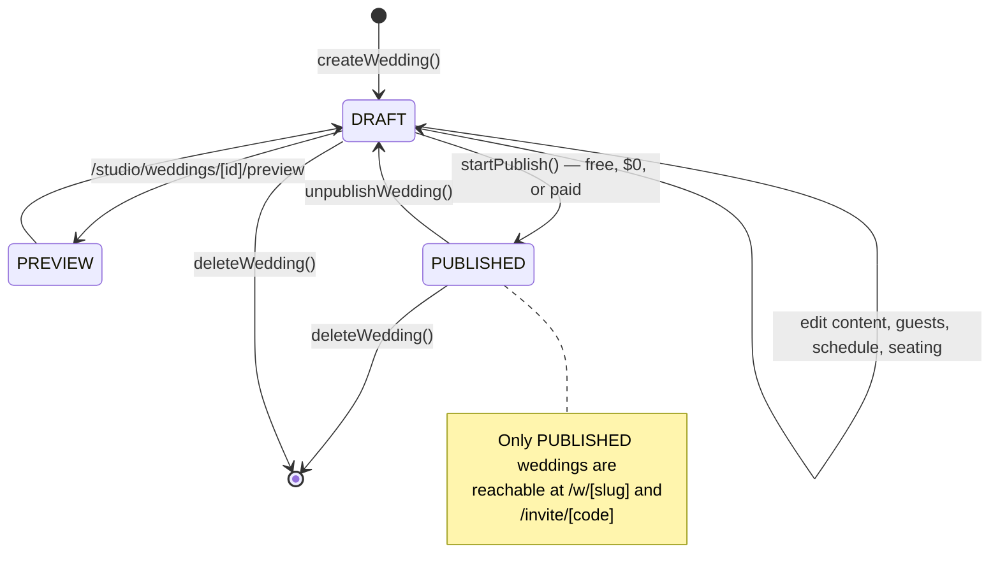

| State | Meaning | Set by |
|---|---|---|
| `DRAFT` | Private to the studio. Guest URLs 404. | `createWedding()` |
| `PUBLISHED` | Live. `publishedAt` stamped. | `startPublish()` / `completePublishFromStripe()` |
| `ARCHIVED` | **In the enum, never set by any code path.** | — |

**Preview** is not a status — it is the route `/studio/weddings/[id]/preview`, which
renders the guest site for the planner while the wedding is still a draft
(`src/components/PreviewBar.tsx` shows the banner).

`duplicateWedding()` copies a wedding as a new DRAFT — useful for a studio running similar
events.

---

# 9. Guests and Invitations

## 9.1 Guest creation

Three routes in, all through `src/server/services/guests.ts`:

- `addGuest(studioId, weddingId, input)` — single, validated by `zGuest`
- `importGuests(studioId, weddingId, actor, csv)` — bulk CSV; returns `{imported, skipped}`, skipping lines with a missing name or malformed email
- Guests can also arrive with a wedding via `duplicateWedding()`

Each guest gets an `inviteCode` from `inviteCode()` in `src/lib/utils.ts`:

```ts
const codeAlphabet = customAlphabet("ABCDEFGHJKMNPQRSTUVWXYZ23456789", 10);
```

10 characters from a 31-character alphabet ≈ 49.5 bits of entropy. The alphabet omits
`I`, `L`, `O`, `0` and `1` — characters a guest could misread off a printed card.
`tests/security.test.ts` asserts both the entropy and the omissions.

## 9.2 Personalization

`personalEvents()` in `src/server/services/events.ts` returns only the events a given
guest is invited to, based on their `groups`. The same wedding therefore renders
differently for each guest — this is the product's core claim.

## 9.3 Sending

| Path | Function | Bounded by |
|---|---|---|
| Bulk | `sendInvitations(studioId, weddingId, actor)` | `invitedAt: null` — cannot re-send |
| Single | `resendInvitation(studioId, guestId, actor)` | `rateLimit("resend:<guestId>", 3, 1h)` |

Bulk sending is paced by `INVITE_SEND_INTERVAL_MS` between messages — a burst of identical
messages from a new domain is what spam filters watch for.

Each bulk send goes through `sendInvitationOnce()` → `runOnce()` with
`invitationKey(weddingId, guestId, inviteCode)` and a 6-hour TTL. The invite code is part
of the key deliberately: regenerating a guest's code is how a planner deliberately
re-issues an invitation, and that should be allowed through immediately.

Resend deliberately does **not** use `runOnce` — re-sending is the whole point of the
button. The rate limit is what bounds it.

## 9.4 Rate limits — complete list

| Key | Limit | Window | Where |
|---|---|---|---|
| `resend:<guestId>` | 3 | 1 hour | `guests.ts` |
| `upload:<studioId>` | 120 | 1 hour | `photos.ts` |
| `logo:<studioId>` | 20 | 1 hour | `branding.ts` |
| `gift:<weddingId>` | 30 | 1 hour | `registry.ts` |
| `rsvp:<inviteCode>` | 6 | 60 s | `invite/[code]/page.tsx` |
| `support:<studioId>` | 10 | 1 hour | `support.ts` |
| `custom-design:<studioId>` | 5 | 24 hours | `custom-design.ts` |
| `access:<ip>` | 3 | 1 hour | `access-requests.ts` |
| `forgot:<ip>` | 5 | 60 s | `forgot-password/page.tsx` |
| `reset:<ip>` | 10 | 10 min | `reset-password/[token]/page.tsx` |
| `login:acct` / `login:ip` | 10 / 30 | 15 min | `lockout.ts` |

---

# 10. Templates

## 10.1 The six templates

Defined in `src/lib/themes.ts`, enumerated in `TemplateKey`:

`BLUSH_ROMANCE` · `MODERN_SAGE` · `CLASSIC_ELEGANCE` · `MIDNIGHT_BLOOM` ·
`PACIFIC_LINEN` · `VELVET_BOTANICAL`

`FALLBACK_TEMPLATE = "BLUSH_ROMANCE"`. `themeFor()` falls back rather than throwing when a
row names a template this build has never heard of — a database outlives a deployment, and
`tests/security.test.ts` covers exactly this case.

## 10.2 Architecture

```
Wedding.template (TemplateKey enum)
  → themeFor(key)          src/lib/themes.ts  → Theme object
  → themeVars(theme)       → CSS custom properties
  → WeddingSite.tsx        src/components/WeddingSite.tsx
  → rendered guest site
```

`isDarkTheme` drives contrast decisions. `src/lib/photo-tone.ts` and
`src/components/SitePhoto.tsx` adapt image treatment per template.

## 10.3 Adding a new template

Every step verified against the three template migrations that already exist
(`20260805090000_midnight_bloom_template` and siblings):

1. **`prisma/schema.prisma`** — add the value to `enum TemplateKey`.
2. **Create a migration** — `npm run db:migrate` generates the `ALTER TYPE ... ADD VALUE`.
3. **`src/lib/themes.ts`** — add the entry to `THEMES` with its palette and fonts.
4. **`src/lib/utils.ts`** — add to `TEMPLATES` (the display registry used by pickers).
5. **`src/app/studio/templates/[template]/page.tsx`** — verify the preview renders.
6. **Fonts** — if a new face is needed, add it to `src/app/layout.tsx` via `next/font`.
7. **Tests** — `tests/security.test.ts` asserts every registered template resolves to a
   complete palette; it will fail if the entry is incomplete.

> **Common mistake:** adding the enum value without the `THEMES` entry. `themeFor()`
> silently falls back to `BLUSH_ROMANCE`, so the template *appears* to work and quietly
> renders the wrong design.

---

# 11. Email

## 11.1 Architecture

`src/lib/email.ts` is the only module that talks to Resend. `src/lib/email-render.ts`
renders the HTML and text bodies.

```ts
const resend = process.env.RESEND_API_KEY ? new Resend(process.env.RESEND_API_KEY) : null;
const SANDBOX_FROM = "onboarding@resend.dev";
const FROM = process.env.EMAIL_FROM ?? `EventOS <${SANDBOX_FROM}>`;
```

## 11.2 Email kinds

The `EmailKind` union — 10 values:

`GUEST_INVITATION`, `RSVP_CONFIRMATION`, `PLANNER_INVITE`, `CUSTOM_DESIGN_REQUEST`,
`PAYMENT_RECEIPT`, `PASSWORD_RESET`, `ACCESS_REQUEST`, `ACCESS_REQUEST_ACK`,
`SUPPORT_TICKET_OPENED`, `SUPPORT_TICKET_REPLY`

Note `EmailKind` is a **TypeScript union, not a database enum** — `EmailLog.kind` is a
plain `String`.

## 11.3 Sender configuration

`EMAIL_FROM` accepts both `Name <address>` and a bare address. It is used two ways:

1. **As the From header** — passed through verbatim.
2. **Extracted to a bare address** in four places, all using the identical expression:
   ```ts
   from.match(/<([^>]+)>/)?.[1] ?? (from.includes("@") ? from.trim() : null)
   ```
   `src/lib/email.ts:96` (`emailConfig().fromAddress`), `src/lib/email.ts:296`
   (`PLATFORM_INBOX`), `src/server/services/access-requests.ts:30`,
   `src/server/services/support.ts:72`.

`emailConfig()` reports problems: missing key, still using the sandbox sender in
production, or a consumer mailbox domain (gmail/outlook/…) whose DMARC policy would reject
the mail. `npm run email:check` prints this.

## 11.4 Failure handling

Three attempts with backoff `[400ms, 1500ms]`, retrying only transient failures. Every
attempt lands in `EmailLog` as `SENT`, `FAILED` or `SKIPPED` with the provider error.
**`sendEmail` never throws.**

## 11.5 E2E behaviour

`playwright.config.ts` sets `RESEND_API_KEY: ""` in `webServer.env`, so the suite makes no
network calls to Resend. This works because `@next/env` only adopts a `.env` value when the
key is `undefined` in the parent environment — an empty string wins.

---

# 12. Storage and Uploads

## 12.1 Drivers

`src/lib/storage.ts` defines one interface and three implementations:

```ts
export interface StorageDriver {
  readonly name: "blob" | "s3" | "local";
  put(key: string, body: Buffer, contentType: string): Promise<StoredObject>;
  deletePrefix(prefix: string): Promise<void>;
  publicUrl(key: string): string;
}
```

| Driver | Selected when | Notes |
|---|---|---|
| `blobDriver()` | `BLOB_READ_WRITE_TOKEN` or `BLOB_STORE_ID` present | `access: "public"`, `addRandomSuffix: false` |
| `s3Driver()` | all of `S3_BUCKET`, `S3_ACCESS_KEY_ID`, `S3_SECRET_ACCESS_KEY` | also reads `S3_ENDPOINT`, `S3_REGION`, `S3_PUBLIC_URL` |
| `localDriver()` | neither configured | writes to `public/uploads`, dev only |

`src/lib/storage-config.ts` holds the single shared predicate (`storageConfigured()`) used
by `env.ts`, `storage.ts` and `/api/ready`, so the three cannot drift apart.

## 12.2 Keys

```
studios/{studioId}/weddings/{weddingId}/{randomUUID()}    photos
studios/{studioId}/brand/{randomUUID()}                   logos
```

`randomUUID()` makes keys unguessable — important because blob objects are public-read.
One prefix per studio is what makes `deletePrefix("studios/{id}/")` a complete cleanup.

## 12.3 Processing and deletion

`src/lib/images.ts` (sharp): `processImage()`, `processLogo()`, `asVariants()`,
`srcSet()`, `fallbackSrc()`. Multiple sizes plus a `blurData` placeholder are produced per
upload; `src/lib/photo-tone.ts` measures luminance/saturation so the renderer can adapt.

Deletion happens in four places, all `deletePrefix`: photo delete, photo replace, logo
replace, logo removal — plus studio deletion in `admin.ts`.

**Security note:** stored objects are publicly readable by URL. Access control is entirely
key unguessability. There is no signed-URL mechanism. *(verified — no signing code exists.)*

---

# 13. Environment Variables

Every variable below is referenced somewhere in `src/`, `prisma/`, `scripts/` or a config
file. **No values appear in this document.**

## 13.1 Required in production

| Variable | Purpose | Notes |
|---|---|---|
| `DATABASE_URL` | Pooled Postgres connection | Server-only |
| `DIRECT_URL` | Direct Postgres connection | Used by migrations |
| `AUTH_SECRET` | JWT signing | Must be ≥32 chars; `env.ts` rejects known placeholder prefixes |
| `APP_URL` | Absolute base for links in emails | `env.ts` rejects localhost in production |
| `UPSTASH_REDIS_REST_URL` | Distributed rate limiting | Required in production by `env.ts` |
| `UPSTASH_REDIS_REST_TOKEN` | ditto | ditto |

`src/lib/env.ts` throws at boot (via `src/instrumentation.ts` → `register()`) if any are
missing in production, failing the deploy rather than serving a broken app.

## 13.2 Expected — feature degrades without them

| Variable | Purpose | Without it |
|---|---|---|
| `RESEND_API_KEY` | Email sending | Emails recorded `SKIPPED` |
| `EMAIL_FROM` | From header | Falls back to the Resend sandbox sender |
| `STRIPE_SECRET_KEY` | Payments | Publishing fails closed in production unless price is $0 |
| `STRIPE_WEBHOOK_SECRET` | Webhook verification | Webhook returns 400 |
| `BLOB_READ_WRITE_TOKEN` *or* `S3_*` | Photo storage | Local driver (dev only) |

## 13.3 Optional

| Variable | Purpose |
|---|---|
| `EMAIL_REPLY_TO` | Reply-to on platform email |
| `ACCESS_REQUEST_TO` | Where access requests go; falls back to the address in `EMAIL_FROM` |
| `SUPPORT_TICKET_TO` | Where ticket notifications go |
| `SHOWCASE_WEDDING_SLUGS` | Which weddings appear on the marketing page |
| `AUTH_TRUST_HOST` | NextAuth behind a proxy |
| `BLOB_STORE_ID` | Alternative blob detection |
| `S3_ENDPOINT`, `S3_REGION`, `S3_PUBLIC_URL` | Non-AWS S3 targets |

## 13.4 Platform-injected (do not set by hand)

`VERCEL_ENV`, `VERCEL_GIT_COMMIT_SHA`, `VERCEL_GIT_COMMIT_REF`,
`VERCEL_GIT_COMMIT_MESSAGE`, `VERCEL_DEPLOYMENT_ID`, `VERCEL_PROJECT_PRODUCTION_URL`,
`NODE_ENV`, `NEXT_RUNTIME`, `CI`

## 13.5 Test-only

`E2E_DATABASE_URL`, `E2E_DIRECT_URL`, `E2E_BASE_URL`, `E2E_PORT`, `E2E_APP_URL` — read
only by `playwright.config.ts`.

## 13.6 Client exposure

> **There are no `NEXT_PUBLIC_*` variables in this repository.** *(verified by grep.)*
> Every variable above is server-only and none is bundled into client JavaScript. Any
> future variable prefixed `NEXT_PUBLIC_` is embedded in the browser bundle and must never
> hold a secret.

---

# 14. Deployment

## 14.1 Local development

```bash
npm install
cp .env.example .env     # then fill in your own values
npm run db:migrate       # or db:deploy
npm run db:seed          # demo data — never against a shared database
npm run dev
```

## 14.2 Vercel

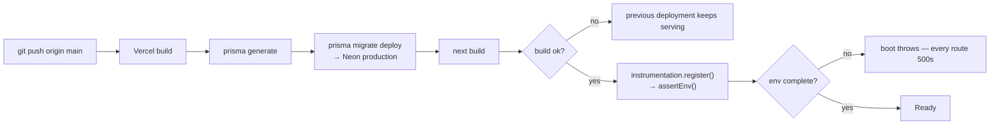

> **The failure mode to know about:** `assertEnv()` runs at *runtime* boot, not build
> time. A missing production variable therefore produces a green build and a completely
> broken deployment. Always check `/api/ready` after deploying.

## 14.3 Preview

Preview uses its own Neon branch. The branch must be **empty**, not a schema-only copy —
a schema-only branch has the tables but an empty `_prisma_migrations`, so
`migrate deploy` replays `init` and fails with `P3018: type "Role" already exists`.

`scripts/reset-preview-db.ts` empties a preview branch safely. It refuses to run against a
database containing any application rows, which makes pointing it at production a
no-op rather than a catastrophe.

## 14.4 E2E environment

`npx playwright test` builds for production and starts a server on port 3100.
`playwright.config.ts` supplies an environment that satisfies the production guard without
weakening it: an `https://e2e.invalid` `APP_URL`, unreachable Upstash on `127.0.0.1:1`
(so `consume()` takes its documented fallback), and an empty `RESEND_API_KEY`.

## 14.5 Verification after deploy

```bash
curl -s https://www.youreventos.com/api/ready
```

Expect `status: "ready"` and the `configured` block. Then check `/api/health` returns 200
and sign in.

## 14.6 Rollback

Vercel keeps previous deployments; promoting an earlier one is the fastest rollback for
**application** code.

> **Migrations do not roll back.** `prisma migrate deploy` has no down-migration. Rolling
> the code back while the schema has moved forward can produce a mismatch. This is why
> additive migrations matter — see [20.2](#20-safe-development-guidelines).

---

# 15. Security Architecture

A full audit lives in `SECURITY_AUDIT.md`. This section describes the mechanisms.

| Control | Implementation |
|---|---|
| Authentication | NextAuth credentials, bcrypt cost 12, timing-equalised via `DUMMY_HASH` |
| Session | JWT, `__Host-` prefix, 12 h, revocable via `sessionsValidFrom` |
| Authorization | `requireAdmin()` / `requireStudio()` at every page and service |
| Tenant isolation | `studioId` in every planner query; check+write in one statement |
| IDOR | 404/redirect rather than 403 everywhere |
| Password reset | 32-byte token, stored hashed, single-use CAS, revokes sessions |
| Rate limiting | 11 distinct limits; Upstash-backed, in-process fallback |
| Webhook | `stripe.webhooks.constructEvent` over the **raw body**, plus event-id idempotency |
| Legal gate | `requireStudio()` blocks every planner surface until both current documents are accepted; the CSV route repeats it inline |
| CSRF | Server Actions with `allowedOrigins` pinned; `sameSite=lax` cookies |
| Headers | CSP, HSTS (2 years, preload), X-Frame-Options, X-Content-Type-Options, Referrer-Policy, COOP, CORP, X-DNS-Prefetch-Control |
| CSP | `default-src 'self'`, `object-src 'none'`, `frame-ancestors 'none'`, `base-uri 'self'`, `form-action 'self'` |
| Secrets | None in the repository; `src/lib/logger.ts` redacts connection strings, API keys, JWTs and `whsec_` values before logging |
| CSV injection | Guest export prefixes `=`, `+`, `-`, `@` cells with an apostrophe |

**Known CSP weakness:** `script-src` includes `'unsafe-inline'`, which defeats most of
CSP's XSS value. The actual defences are React's escaping and the absence of any
`dangerouslySetInnerHTML` in the codebase *(verified by grep — zero occurrences)*.

**Rate-limit fallback:** `consume()` degrades to the in-process limiter when Redis is
unreachable, and logs `ratelimit.redis_unavailable`. This is deliberate — refusing every
request when the limiter is down converts a dependency blip into a total outage.

**Client IP:** taken from `x-forwarded-for`. This is safe on Vercel specifically, because
Vercel overwrites that header and does not forward external IPs. If a proxy is ever placed
in front of Vercel, switch to `x-vercel-forwarded-for`.

---

# 16. Error Handling

Two error classes, from `src/lib/errors.ts`:

| Class | Meaning | Shown to user |
|---|---|---|
| `UserError(message, code?)` | Expected, actionable | Yes — the message was written for them |
| Anything else | A bug or infrastructure fault | No — one sentence plus a reference id |

`reportError(scope, err, fallback)` draws the line: a `UserError` is logged at `warn` and
its own message returned; anything else is logged at `error` with its stack and reduced to
`"<fallback> (reference abc123)"`.

**The pattern that matters:**

```ts
// in a Server Action
const outcome = await someServiceOutcome(...);   // returns {ok, message}
// NOT: await someService(...)  ← an uncaught UserError replaces the page
```

`src/app/error.tsx` renders nothing from the error object — in production Next replaces
server-side error messages with a generic string before they cross to the client, leaving
only `digest`, so there is nothing safe *or* useful to display beyond the reference.

---

# 17. Logging and Observability

## 17.1 Structured logging

`src/lib/logger.ts` — one JSON line per event to stdout, which Vercel forwards to any
attached drain. `log.debug/info/warn/error(event, fields)`.

**Redaction is the reason it exists.** Errors near a database call routinely carry a
connection string; `console.error(err)` would print it into a searchable, months-retained
log. The module strips connection strings, API keys, JWTs, `whsec_` values and guest email
addresses, and survives cyclic objects.

## 17.2 Audit log

`logAudit()` in `src/server/services/audit.ts` writes `AuditLog` rows with `actorType`
(ADMIN / PLANNER / GUEST / SYSTEM), `action`, `studioId?`, `targetId?`. Visible at
`/admin/activity` and per-studio on `/admin/planners/[id]`.

## 17.3 Email log

Every send attempt lands in `EmailLog` with status and provider error. This is the first
place to look when a planner says an invitation never arrived.

## 17.4 Health and readiness

| Endpoint | Answers |
|---|---|
| `/api/health` | "is this process alive" — 200/503, no body |
| `/api/ready` | "is this instance configured to do its job" — `{status, db, configured{database, auth, email, storage, payments, distributedRateLimit}, ms}` |

`status` is `ready` when everything is configured, `degraded` when email or storage is
missing, `unavailable` (503) when the database or auth is broken.

`sweepIdempotencyKeys()` is called from the health probe rather than a cron — the table is
small and the delete is indexed.

## 17.5 What is intentionally not monitored

- **No APM or error tracker.** No Sentry, no Datadog. Deliberate at current scale.
- **No cron jobs.** There is no `vercel.json`; nothing is scheduled.
- **No uptime monitoring in-repo** — `OPERATIONS.md` records that Better Stack polls
  `/api/health` externally.

---

# 18. Testing

## 18.1 Suites

| Suite | Runner | Count | Command |
|---|---|---|---|
| Unit / service | Vitest | 214 across 13 files | `npm test` |
| E2E security | Playwright | 29 | `npx playwright test` |

## 18.2 Unit test files

| File | Covers |
|---|---|
| `tests/tenancy.test.ts` | Every service query carries `studioId` |
| `tests/security.test.ts` | Logger redaction, invite-code entropy, slugify, validators, rate limiter, themes, **security headers** |
| `tests/races.test.ts` | Free-wedding claim and gift claim under concurrency |
| `tests/support.test.ts` | Ticket authorization both directions |
| `tests/pricing.test.ts` | Price resolution and versioning |
| `tests/billing-subscriptions.test.ts` | Publish pricing, duplicate charges, webhook idempotency |
| `tests/production-hardening.test.ts` | Fail-closed billing, complete deletion, live-deployment predicate |
| `tests/invite-actions.test.ts` | Resend failure paths, message hygiene |
| `tests/reliability.test.ts` | Retry, degradation |
| `tests/branding.test.ts` | Logo handling |
| `tests/storage-config.test.ts` | The shared storage predicate |
| `tests/audit-fixes.test.ts` | Regressions from earlier audits |
| `tests/legal.test.ts` | The Terms/Privacy gate: version equality, idempotent writes, admin exemption |

**The testing philosophy worth preserving:** these use a **fake Prisma client**, not a
database, because what is under test is *the query the service builds*. A real database
with one studio in it would let an unscoped query pass by accident.

## 18.3 E2E

`tests/e2e/` — `authorization.spec.ts` (13), `abuse.spec.ts` (5), `headers.spec.ts` (3, one
parameterised over three paths so it reports 5), `legal.spec.ts` (6).

They run against a **production build** deliberately: the `__Host-` cookie prefix, the
security headers and the boot-time env guard only exist there.

`tests/e2e/helpers.ts` contains two functions worth understanding before editing anything:

- `assertSessionUsable()` — every sign-in ends by fetching a page only that account may
  see and requiring 200. Without it, four tenancy tests once passed while proving nothing,
  because "redirected to /login" satisfied their assertion.
- `expectBouncedFromStudioResource()` — explicitly **rejects** a `/login` redirect, because
  an unauthenticated caller would otherwise satisfy a tenancy assertion.

## 18.4 Running E2E

```bash
export E2E_DATABASE_URL='<neon e2e branch, pooled>'
export E2E_DIRECT_URL='<neon e2e branch, direct>'
npx playwright test
```

Coverage thresholds are per-module in `vitest.config.ts`, and every number was measured
before it was written down.

---

# 19. Debugging Runbook

### Login fails
1. `/api/ready` — is `auth: true`?
2. `?error=rate` in the URL means the lockout tripped: 10 per account or 30 per IP in 15 min. Wait or check Upstash.
3. `?error=1` is a bad credential.
4. Session set but immediately signed out → `AUTH_SECRET` changed, or `User.sessionsValidFrom` is in the future.
5. Cookie not stored → the site must be HTTPS; `__Host-` requires Secure.

### Password reset fails
1. Check `EmailLog` for a `PASSWORD_RESET` row. `SKIPPED` means email isn't configured.
2. Link expired (`expiresAt`) or already used (`usedAt`) — both refuse by design.
3. `reset:<ip>` limit is 10 per 10 minutes.

### Invitation not received
1. **`EmailLog` first** — filter by `toEmail`. `SENT` means Resend accepted it; the problem is downstream.
2. `SKIPPED` → `RESEND_API_KEY` missing, or `emailConfig()` reported a problem.
3. `FAILED` → the provider error is in the row.
4. Verify the domain is verified in Resend and `EMAIL_FROM` is on it.
5. `npm run email:check` prints the whole configuration.

### Resend button fails
1. Three per guest per hour. The fourth returns a message beside the button — this is correct behaviour, not a bug.
2. If the **page** breaks rather than the button, a Server Action is throwing: it must return an outcome (see `src/server/services/invite-actions.ts`).

### RSVP fails
1. Wedding must be `PUBLISHED` — otherwise `/invite/[code]` 404s.
2. `rsvp:<code>` allows 6 per minute.
3. `zRsvp` rejects a status outside `ACCEPTED | DECLINED | MAYBE`.

### Wedding won't publish
1. **Most likely:** Stripe is not configured and the price is non-zero → `BILLING_UNAVAILABLE`. Either configure Stripe or set the per-wedding price to `$0` in `/admin/settings`.
2. `No active PER_WEDDING price is configured` → the price-plan seed did not run.
3. Already-published weddings return `{ok: true}` and do nothing.

### Planner stuck on /accept-terms
1. They must tick the box — the server ignores a submission without `accept=yes`.
2. If they accept and are sent straight back, check `LegalAcceptance` for rows matching **both** current versions in `src/lib/legal.ts`. A row for an older version does not count, by design.
3. A planner who reaches the gate unexpectedly usually means a version constant was bumped.

### Migration fails
| Error | Meaning | Action |
|---|---|---|
| `P3018` + `already exists` | Schema present, `_prisma_migrations` empty (schema-only branch) | Empty the branch — do **not** `migrate resolve` |
| `P1001` | Cannot reach the server | Check the connection string host |
| `P1013` | Malformed URL | Usually shell quoting; single-quote the whole value |
| `P2002` | Unique violation | Two rows claiming one constraint |

### Storage / upload fails
1. `/api/ready` → `storage`.
2. `120` uploads per studio per hour.
3. Body limit is `4.5mb` (`next.config.mjs`).
4. Driver in use is logged at boot: `[storage] driver=…`.

### Vercel deployment fails
1. Build log: `prisma migrate deploy` runs before `next build`.
2. Build green but every route 500s → `assertEnv()` threw at boot. The message names the missing variables.

### `/api/health` or `/api/ready` failing
`health` 503 → the process cannot serve. `ready` 503 → database unreachable or auth
unconfigured. `degraded` → email or storage missing; the app still works.

### Rate-limit issues
`distributedRateLimit: false` in `/api/ready` means Upstash is unset and limits are
per-instance. Look for `ratelimit.redis_unavailable` in the logs.

---

# 20. Safe Development Guidelines

## 20.1 Modifying the database

1. Edit `prisma/schema.prisma`.
2. `npm run db:migrate` against a **local or branch** database.
3. Review the generated SQL by hand.
4. Run `npm test`.
5. Commit schema and migration together.

## 20.2 Migration rules

> **Never edit a migration that has been applied anywhere.** Prisma stores a checksum; a
> changed file makes the next `migrate deploy` fail on every environment that already ran
> it.

> **Prefer additive migrations.** There is no down-migration. An additive change lets you
> roll application code back without a schema mismatch.

Adding a required column to a populated table needs three deploys: add nullable →
backfill → make required.

## 20.3 Modifying services

- Keep `import "server-only"` at the top.
- Take `studioId` as a parameter; never read it from input.
- Keep check and write in one statement (`updateMany` with the tenant in `WHERE`).
- Throw `UserError` for expected failures; let real faults propagate.
- Add the query-shape test to `tests/tenancy.test.ts`.

## 20.4 Adding an API route

Decide the auth model first — session, signature, or public — and implement it in the
handler. Return 404 rather than 403 for resources whose existence is sensitive. If it
handles a webhook, verify the signature over the **raw body**.

## 20.5 Modifying authorization

Change `src/server/services/context.ts` and nothing else. If a change makes a tenancy test
fail, the change is wrong — do not adjust the test.

## 20.6 Required before merging

```bash
npm run typecheck
npm run lint
npm test
npx next build          # NOT `npm run build` — that migrates
npx playwright test
```

## 20.7 Things never to do

| Never | Why |
|---|---|
| Run `npm run db:seed` against production | Creates `password123` accounts |
| Run `npm run build` locally without checking `DATABASE_URL` | Migrates whatever it points at |
| Edit an applied migration | Checksum mismatch breaks every environment |
| Weaken `assertTestDatabase()` | It is what stops E2E wiping a real database |
| Trust a client-supplied `studioId` | The tenant comes from the session |
| Catch `UserError` and swallow it silently | The planner needs the message |
| Add `NEXT_PUBLIC_` to anything secret | It is embedded in the browser bundle |
| Relax the CSP to make a script work | |
| Commit `.env*` | `.gitignore` covers `.env*` with `!.env.example` |

---

# 21. External Integrations

| Integration | Where | Failure behaviour |
|---|---|---|
| **Vercel** | Hosting, build, env injection | — |
| **Neon** | `DATABASE_URL` / `DIRECT_URL`; pooled vs direct endpoints | `/api/ready` reports `db: unreachable`, 503 |
| **Resend** | `src/lib/email.ts` | Never throws; records `SKIPPED`/`FAILED` |
| **Stripe** | `src/lib/stripe.ts`, `subscriptions.ts`, `stripe-events.ts`, `/api/webhooks/stripe` | Publishing fails closed in production unless price is $0 |
| **Vercel Blob** | `blobDriver()` | Falls back only if unconfigured, not if failing |
| **S3-compatible** | `s3Driver()` | ditto |
| **Upstash Redis** | `src/lib/ratelimit.ts` | Degrades to in-process limiter, logged |

**Not integrated:** Sentry, Datadog, PostHog, Segment, Twilio, Cloudinary, Algolia,
Remotion. *(verified against `package.json`.)*

---

# 22. Appendix: verification notes

## 22.1 What could not be verified

| Area | Why |
|---|---|
| Runtime behaviour of Stripe subscriptions | Stripe has never been enabled in production; the subscription and webhook paths are covered by unit tests against mocks only |
| Actual production environment variable values | Not readable from the repository, and deliberately not documented |
| Vercel project settings (regions, protection, domains) | Configured in the Vercel dashboard, not in the repository — there is no `vercel.json` |
| Neon branch topology beyond names | Managed in the Neon console |
| Whether `ARCHIVED` weddings were ever used | The enum value exists; no code sets it |

## 22.2 Documentation gaps

- **`loading.tsx` files** — none exist; there are no route-level loading states.
- **`MEMBER` role** — defined but unreachable. Its intended behaviour is undocumented.
- **`ARCHIVED` status** — defined but unset.
- **Help Center articles** — 26 exist in `src/lib/help.ts`; their content is not reproduced here.
- **CSS architecture** — `src/app/globals.css` is large and hand-written; this handbook covers the design tokens it exposes but not its full structure.

## 22.3 Commit provenance

This handbook documents **`f912143`**, the head of `origin/main`.

That commit added the Terms and Privacy acceptance system described throughout:
`LegalAcceptance`, `src/lib/legal.ts`, `src/server/services/legal.ts`, `/terms`,
`/privacy`, `/accept-terms`, the `requireStudio()` gate and migration
`20260814120000_legal_acceptance`.

One later change is presentation only and does not affect anything documented
here: the legal documents were moved off the marketing site's dark `.m-plate`
onto a light, high-contrast document layout (`.legal` in
`src/app/(marketing)/marketing.css`). The legal text, the version constants and
the acceptance logic were not touched.

The commit immediately before it, `fe20a8b` ("Harden production launch"), differs by
exactly five files — the invitation resend fix:

| File | At `fe20a8b` |
|---|---|
| `src/server/services/invite-actions.ts` | absent |
| `src/components/InviteButtons.tsx` | absent |
| `tests/invite-actions.test.ts` | absent |
| `src/app/studio/weddings/[id]/guests/page.tsx` | resend action threw instead of returning an outcome |
| `tests/e2e/abuse.spec.ts` | waited on `networkidle` rather than the button state |

Unit test counts at each point, so a mismatch tells you which state you are looking at:

| State | Unit tests | E2E |
|---|---|---|
| `fe20a8b` | 180 across 11 files | 23 |
| `eb056b3` | 193 across 12 files | 23 |
| `f912143` (this document) | **214 across 13 files** | **29** |

If you are ever reading this handbook against `fe20a8b`,
[3.5](#35-forms-and-server-actions), [9.3](#93-sending) and
[16](#16-error-handling) describe behaviour that does not exist there.

## 22.4 Related documents

| File | Contents |
|---|---|
| `README.md` | Quick start |
| `DEPLOYMENT.md` | Vercel, Neon, Resend, Stripe and Preview setup |
| `OPERATIONS.md` | Backups, monitoring, incident procedure |
| `SECURITY.md` | Security policy |
| `SECURITY_AUDIT.md` | Current verified security state |
| `SECURITY-AUDIT-2026-08.md` | The August 2026 audit |
| `EMAIL.md` | SPF/DKIM/DMARC and deliverability |
| `SUPPORT.md` | Support ticket system |
| `AUDIT.md` | Earlier audit history |

---

*End of handbook.*
